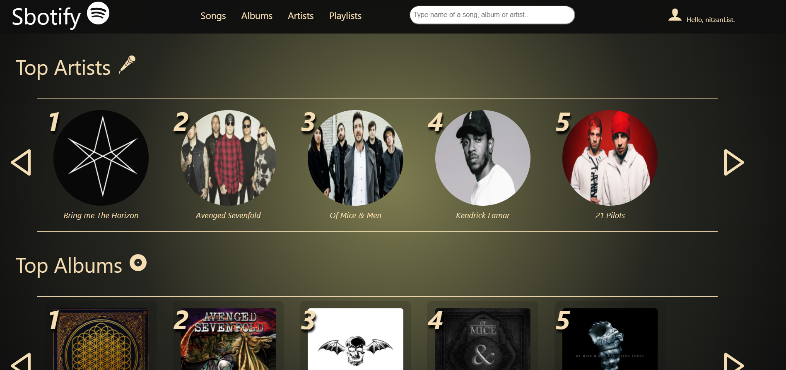

# Welcome to Sbotify!

A spotify like site that alows you to browse artists and their music! :musical_note: :microphone:

The site was built using:

- React ⚛️
- express.js :computer:
- mySql :floppy_disk:
- sequelize (ORM) :arrows_clockwise:
- styled components (no material ui, all styles 100% by me) :nail_care:
- mixpanel :bar_chart:

  

## Register and Login

A fully functioning authentication system, using bcrypt to hash passwords.   

Error handling while registering  

## Analytics

Monitoring each user's actions in the site with Mixpanel, which can later be reviewd and analized on mixpanel's dashboard. 
[link to ERD](https://drawsql.app/cyber4s-1/diagrams/song-stream)
